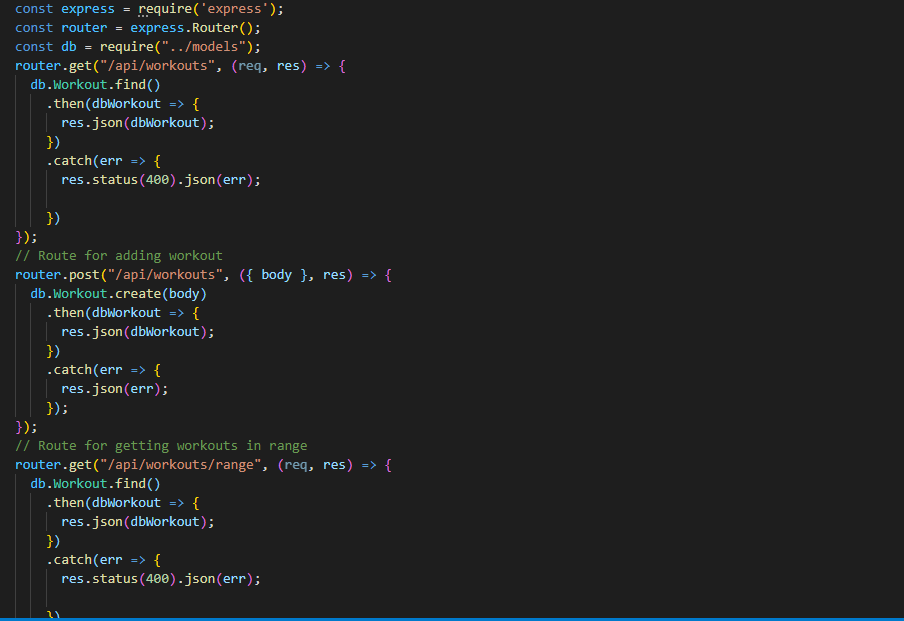
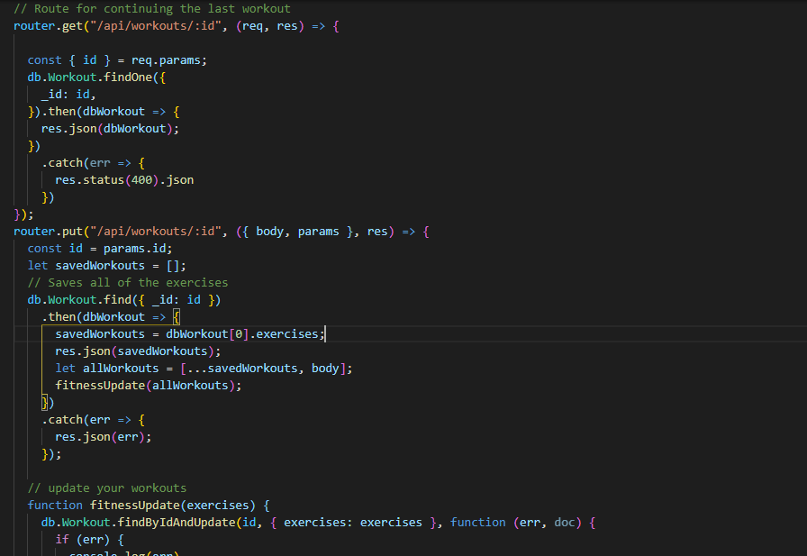

# Workout_Tracker

 ## Description 
 The workout tracker is a fitness app that lets users input a new exercise to their new fitness plan, add exercises to their previous workout plan and also to be able to view the combined weight of multiple exercises on their status page. In this app, the user is able to pick from a drop down menu of a resistance workout or cardio workout and customize the name, distance and duration. The user is also able to track the name, type, weight, sets, reps and duration of the exercise. 

## Process
 In this workout tracker assignment, I had to create the Mongo database with Mongoose schema and handle routes with Express. The front end code of the workout tracker was provided, so it was nice to see the completed fitness app come together at the end.

 Here is a Gif of the workout tracker in action:

 
 
 Snippet of the api route code:
 
 
 2nd part of the api route code:
 

 ## Installation
 You will need VS code and the dependencies are Express, Mongoose Schema and Mongo database.
 
 ## Usage 
 A consumer will be able to reach their fitness goals more quickly when they track their workout progress.

### Installing/Technology Used

The following platforms were required to build this website:

1) VS code
2) GitBash/Terminal
3) GitLab
4) GitHub
5) Mongo database
6) Mongoose Schema
7) Express

## Built With

* [Node.js](https://nodejs.dev/learnthe-package-json-guide)
* [Express](http://expressjs.com/)
* [Mongoose Schema](https://mongoosejs.com/docs/guide.html)
* [Mongo db](https://www.mongodb.com/)

## Deployed Link

* [See Live Site](https://warm-coast-71840.herokuapp.com/?id=5fa76698d4a80200179c6c47)
 ## Authors

* **Kelly Kim** 

- [Link to Github](https://github.com/kellykim831)
- [Link to LinkedIn](https://www.linkedin.com/in/realtorkellykim/)
- [Link to Facebook](https://www.facebook.com/kimkelz)

## Acknowledgments

* [Link to Google](https://www.google.com)
* [Link to W3 Schools](https://www.w3schools.com)
* [Link to StackOverflow](https://www.stackoverflow.com)
* [Link to Node.js](https://nodejs.org/en/)